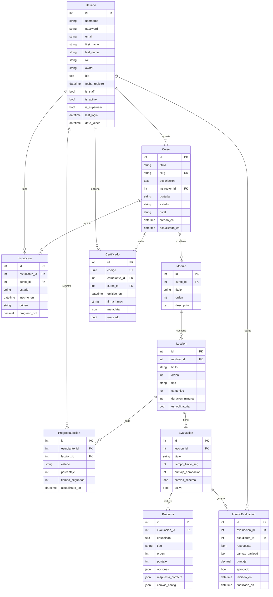

# Estructura de la base de datos

Modelo de datos del LMS (Django + PostgreSQL). Jerarquía principal:

**Usuario → Curso → Módulo → Lección**, con inscripciones, progreso, evaluaciones y certificados.

## Diagrama entidad-relación

---

## Relaciones

| Origen | Destino | Cardinalidad | Campo FK / vínculo | On delete |
|--------|---------|--------------|--------------------|-----------|
| Curso | Usuario (instructor) | N : 1 | `instructor_id` | PROTECT |
| Modulo | Curso | N : 1 | `curso_id` | CASCADE |
| Leccion | Modulo | N : 1 | `modulo_id` | CASCADE |
| Inscripcion | Usuario (estudiante) | N : 1 | `estudiante_id` | CASCADE |
| Inscripcion | Curso | N : 1 | `curso_id` | CASCADE |
| ProgresoLeccion | Usuario | N : 1 | `estudiante_id` | CASCADE |
| ProgresoLeccion | Leccion | N : 1 | `leccion_id` | CASCADE |
| Evaluacion | Leccion | 1 : 1 | `leccion_id` | CASCADE |
| Pregunta | Evaluacion | N : 1 | `evaluacion_id` | CASCADE |
| IntentoEvaluacion | Evaluacion | N : 1 | `evaluacion_id` | CASCADE |
| IntentoEvaluacion | Usuario | N : 1 | `estudiante_id` | CASCADE |
| Certificado | Usuario | N : 1 | `estudiante_id` | CASCADE |
| Certificado | Curso | N : 1 | `curso_id` | CASCADE |

### Unicidades

| Tabla | Constraint |
|-------|------------|
| Curso | `slug` único |
| Modulo | `(curso, orden)` único |
| Leccion | `(modulo, orden)` único |
| Inscripcion | `(estudiante, curso)` único |
| ProgresoLeccion | `(estudiante, leccion)` único |
| Certificado | `codigo` único · `(estudiante, curso)` único |

---

## Tablas y atributos

### Usuario
App: `usuarios` · Extiende `AbstractUser` de Django.

| Atributo | Tipo | Notas |
|----------|------|-------|
| id | PK (AutoField) | Automático |
| username | CharField | Heredado, único |
| password | CharField | Heredado (hash) |
| email | EmailField | Heredado |
| first_name | CharField | Heredado |
| last_name | CharField | Heredado |
| is_staff | BooleanField | Heredado |
| is_active | BooleanField | Heredado |
| is_superuser | BooleanField | Heredado |
| last_login | DateTimeField | Heredado, nullable |
| date_joined | DateTimeField | Heredado |
| rol | CharField(20) | `estudiante` \| `instructor` \| `admin` |
| avatar | ImageField | nullable, `avatars/` |
| bio | TextField | opcional |
| fecha_registro | DateTimeField | auto_now_add |

### Curso
App: `cursos`

| Atributo | Tipo | Notas |
|----------|------|-------|
| id | PK | Automático |
| titulo | CharField(200) | |
| slug | SlugField | único; se genera desde el título |
| descripcion | TextField | |
| instructor_id | FK → Usuario | PROTECT |
| portada | ImageField | nullable, `cursos/` |
| estado | CharField(20) | `borrador` \| `publicado` \| `archivado` |
| nivel | CharField(50) | default `intermedio` |
| creado_en | DateTimeField | auto_now_add |
| actualizado_en | DateTimeField | auto_now |

### Modulo
App: `cursos`

| Atributo | Tipo | Notas |
|----------|------|-------|
| id | PK | Automático |
| curso_id | FK → Curso | CASCADE |
| titulo | CharField(200) | |
| orden | PositiveIntegerField | unique con curso |
| descripcion | TextField | opcional |

### Leccion
App: `cursos`

| Atributo | Tipo | Notas |
|----------|------|-------|
| id | PK | Automático |
| modulo_id | FK → Modulo | CASCADE |
| titulo | CharField(200) | |
| orden | PositiveIntegerField | unique con módulo |
| tipo | CharField(20) | `contenido` \| `video` \| `quiz` \| `recurso` |
| contenido | TextField | opcional |
| duracion_minutos | PositiveIntegerField | default 10 |
| es_obligatoria | BooleanField | default True |

### Inscripcion
App: `cursos`

| Atributo | Tipo | Notas |
|----------|------|-------|
| id | PK | Automático |
| estudiante_id | FK → Usuario | CASCADE |
| curso_id | FK → Curso | CASCADE |
| estado | CharField(20) | `activa` \| `completada` \| `cancelada` |
| inscrito_en | DateTimeField | auto_now_add |
| origen | CharField(20) | `web` \| `legacy_csv` \| `api` |
| progreso_pct | DecimalField(5,2) | default 0 |

### ProgresoLeccion
App: `progreso`

| Atributo | Tipo | Notas |
|----------|------|-------|
| id | PK | Automático |
| estudiante_id | FK → Usuario | CASCADE |
| leccion_id | FK → Leccion | CASCADE |
| estado | CharField(20) | `no_iniciada` \| `en_progreso` \| `completada` |
| porcentaje | PositiveIntegerField | default 0 |
| tiempo_segundos | PositiveIntegerField | default 0 |
| actualizado_en | DateTimeField | auto_now |

### Evaluacion
App: `evaluaciones`

| Atributo | Tipo | Notas |
|----------|------|-------|
| id | PK | Automático |
| leccion_id | OneToOne → Leccion | CASCADE |
| titulo | CharField(200) | |
| tiempo_limite_seg | PositiveIntegerField | default 600 |
| puntaje_aprobacion | PositiveIntegerField | default 70 |
| canvas_schema | JSONField | payload para Canvas SPA |
| activo | BooleanField | default True |

### Pregunta
App: `evaluaciones`

| Atributo | Tipo | Notas |
|----------|------|-------|
| id | PK | Automático |
| evaluacion_id | FK → Evaluacion | CASCADE |
| enunciado | TextField | |
| tipo | CharField(30) | `opcion_multiple` \| `verdadero_falso` \| `canvas_hotspot` \| `canvas_dibujo` |
| orden | PositiveIntegerField | |
| puntaje | PositiveIntegerField | default 1 |
| opciones | JSONField | lista |
| respuesta_correcta | JSONField | |
| canvas_config | JSONField | opcional |

### IntentoEvaluacion
App: `evaluaciones`

| Atributo | Tipo | Notas |
|----------|------|-------|
| id | PK | Automático |
| evaluacion_id | FK → Evaluacion | CASCADE |
| estudiante_id | FK → Usuario | CASCADE |
| respuestas | JSONField | |
| canvas_payload | JSONField | opcional |
| puntaje | DecimalField(5,2) | |
| aprobado | BooleanField | |
| iniciado_en | DateTimeField | auto_now_add |
| finalizado_en | DateTimeField | nullable |

### Certificado
App: `certificados`

| Atributo | Tipo | Notas |
|----------|------|-------|
| id | PK | Automático |
| codigo | UUIDField | único, no editable |
| estudiante_id | FK → Usuario | CASCADE |
| curso_id | FK → Curso | CASCADE |
| emitido_en | DateTimeField | |
| firma_hmac | CharField(128) | HMAC-SHA256 |
| metadata | JSONField | opcional |
| revocado | BooleanField | default False |

---

## Notas

- Motor: PostgreSQL
- Definición fuente: modelos en `backend/apps/*/models.py`.
